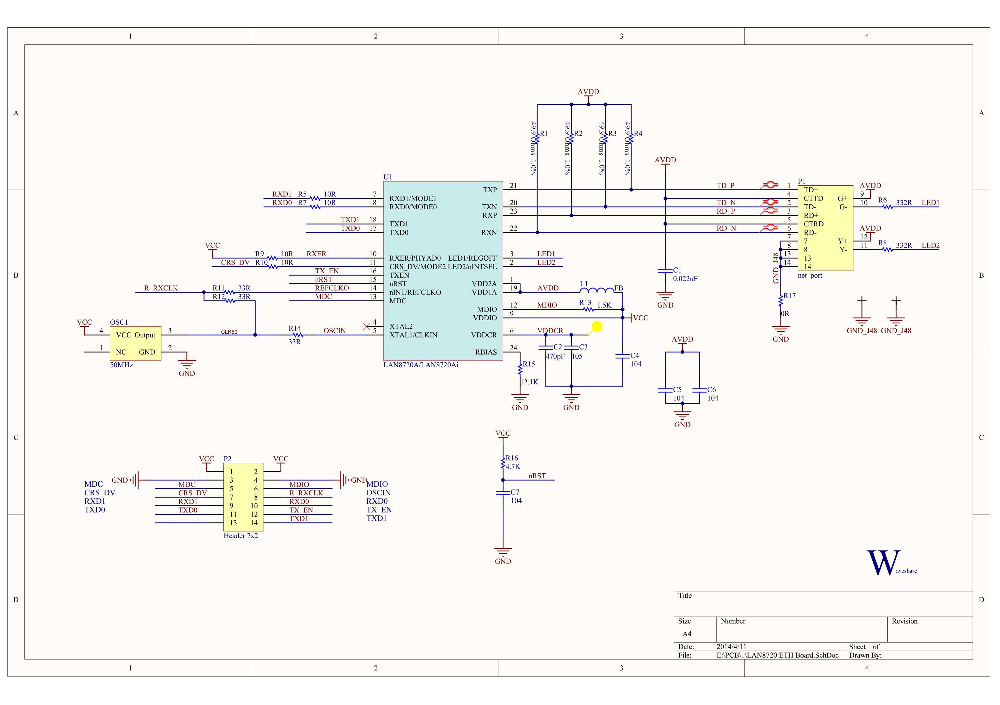
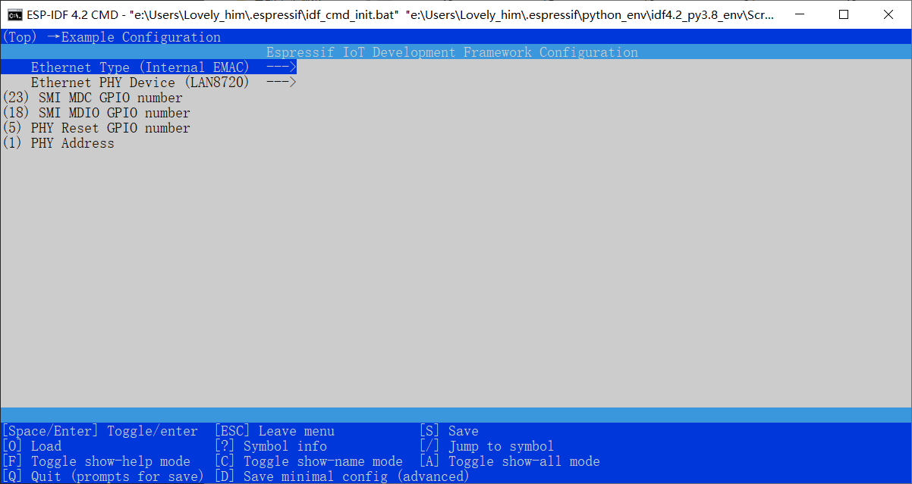

# ESP32 单片机学习笔记 - 05 - 例程学习

> 暂停了半个多月的学习，去调车了。现在课设开始了，赶紧回来把一开始的“以太网”目标学完。但是却发现，好像和自己的理解不太一样。

# 一、以太网基本示例 - Ethernet

> 编程指南：[以太网](https://docs.espressif.com/projects/esp-idf/zh_CN/latest/esp32/api-reference/network/esp_eth.html)，啥介绍都没有，我啥了。我把例程都作为后还是清楚怎么用以太网，就发觉自己是不是理解错了，学习方向/顺序是不是错了。
> 官方例程：[ethernet/basic](https://github.com/espressif/esp-idf/tree/1d7068e/examples/ethernet/basic)，这个例程只有以太网连接功能。
> > 编程指南（英文）：[Ethernet](https://docs.espressif.com/projects/esp-idf/en/latest/esp32/api-reference/network/esp_eth.html?highlight=esp_eth_set_default_handlers)，惊呆了，原来所有内容都在英文版，中文版一个字没有。

## 1.确定方案

> 先明白一下概念，以下百科内容：
> 1. 以太网（ Ethernet ）是应用最广泛的局域网通讯方式，同时也是一种协议。以太网协议定义了一系列软件和硬件标准，从而将不同的计算机设备连接在一起。以太网（ Ethernet ）设备组网的基本元素有交换机、路由器、集线器、光纤和普通网线以及以太网协议和通讯规则。以太网中网络数据连接的端口就是以太网接口。
> 2. 以太网接口TCP/IP协议。
> 3. 几种常见的以太网接口类型：SC光纤接口、RJ-45接口、FDDI接口、BNC接口、Console接口。

- 根据上述百科，我明白到：以太网是**局域网**的通讯方式,以太网是具有**TCP/IP协议**，以太网常用接口有**RJ45接口**。
- 搜索“ESP32 以太网”得到几个方案，大致可以分为两类。1）使用转协议模块，将以太网转为`uart、spi`等方式通讯。2）使用直连模块，直接使用`RMII协议`链接以太网。而这些模块一般就是一个`PHY芯片`，加一个输入网络接口和一排输出排针组成。

> 意识到我好像还不懂`PHY`是什么，百科内容以下：(TCP/IP协议也不懂，不过下一章再补充，和学习例程时一起补充)
> 1. PHY（英语：Physical），中文可称之为端口物理层，是一个对[OSI模型物理层](https://baike.baidu.com/item/OSI%E6%A8%A1%E5%9E%8B)的共同简称。
> 2. PHY连接一个数据链路层的设备（MAC）到一个物理媒介，如光纤或铜缆线。（也就是说：单片机设备或电脑设备 - PHY芯片 - 网线）
> 3. PHY是一个操作OSI模型物理层的设备。*一个以太网PHY是一个芯片*，可以发送和接收以太网的数据帧（frame）。它通常缺乏NIC（网络接口控制器）芯片所提供的Wake-on-LAN或支持Boot ROM的先进功能。此外，不同于NIC，PHY没有自己的MAC地址。

- 在找“ESP32 以太网”时，找到一个帖子，属个人论坛的：[ESP32 有线接入以太网方法 ](https://www.guaishow.cn/archives/84/)，介绍到可以使用`LAN8720芯片`将ESP32接入以太网。
- 乐鑫也有这种方案的模块：[ESP32-Ethernet-Kit V1.2 入门指南](https://docs.espressif.com/projects/esp-idf/zh_CN/latest/esp32/hw-reference/esp32/get-started-ethernet-kit.html?highlight=ethernet)，不过是在中间再加了一个转换模块，将以太网通讯转换为SPI通讯了？我想着要上就上原生接口，才能学到东西。所以选择某宝找“*LAN8720 网络模块 以太网收发器 ETH RMII 接口*”，提醒：这模块好像有原版和仿制之分，两者居然差了三倍多的价格。请购买时注意，自行选择。
- 以下是我购买的模块的资料：资料下载：`https://pan.baidu.com/s/1T_fFt56sM9qQ4bbrA2oHnA` 提取码：`6aqz`。取自某宝，因为不会失效吧……

## 2.准备工作

- 在选择好方案，模块到手后开始尝试。下载例程，看原理图，查接线。在例程 [examples/ethernet/](https://github.com/espressif/esp-idf/tree/1d7068e4be430edd92bb63f2d922036dcf5c3cc1/examples/ethernet) ，页面下的说明文档`README.md`中有说明接线方法。



- 特别说明了**RMII PHY接线固定**，共有6个引脚。**SMI 接线不固定**，共2个引脚。模块共11个有效引脚，8个信号引脚，2个电源引脚，1个晶振/复位引脚。
- 在模块原理图中可以得知，该模块上已经焊了一个50MHz的晶振供频率了。这个知识点注意，一会配置工程需要用到。

- 接好线后，还不可以，在说明文档`README.md`还有一步，配置工程。这一步操作，在[快速入门 第七步：配置](https://docs.espressif.com/projects/esp-idf/zh_CN/latest/esp32/get-started/index.html#get-started-configure)，中也有提到，不过之前的例程都不需要配置，所以我之前也没配置过。


- 在idf终端中，把目录地址切换到工程下，再使用指令：`idf.py menuconfig`就可以打开菜单界面。配置完毕后工程会生成一个`sdkconfig`的配置文件。再使用`idf.py build`指令编译工程后，工程会出现在`build/config`上生成一个`sdkconfig.h`的头文件。里面一堆宏定义，然后例程里一些配置的切换就是感觉这些宏定义来的。所以说，官方就是推荐在写工程时尽量使用这些宏定义，这样其他人用我工程时，就可以有可视化的界面来修改工程了。

- 这次例程中，只需要配置2个界面的内容就可以了。

- 1. 前2个选项要和我一样，（以太网类型）`Ethernet Type - Internal EMAC` ，模块选择 `LAN8720`。 2个SMI引脚我并为改动，使用默认，复位引脚也是。而最后一个是**PHY芯片地址设置**，根据模块原理图可以得知LAN8720的PHYAD0引脚接了上拉电阻，再根据帖子[ESP32 有线接入以太网方法 ](https://www.guaishow.cn/archives/84/)，可以知道`PHY Address`选择1即可。



- 2. 第一个选项要选择`RMII`，目前ESP32只支持这个模式。注意第二个选项，选择`Output RMII clock from internal`，虽然我并没有接esp的输出引脚给lan8720，不过因为我无法接lan8720的输出引脚到esp，所以不选输入，只能选择输出。选择输出后要设置引脚（16/17），我选择16。然后其他的东西暂时可以不用改了。
- 


- 修改完毕后，把例程编译然后下载，看看实验现象。如果正常的话就会打印下图的内容，其中的IP地址因人而异。


- 踩坑总结：
- 1. 一开始我没配置对参数，50MHz的频率设置为输入，导致例程下载进去后单片机一直复位（监视器反复刷屏），然后通过看报错信息知道是开启以太网时就报错，然后复位。
- 2. 后来修改对参数后，不会复位了，但是监视器显示只运行到  `I (424) eth_example: Ethernet Started` 这一步就停止了，还是没有进入到第二步的 `I (4424) eth_example: Ethernet Link Up` 。找了好久问题才发现原来是网线坏了……我换了一根网线就好了，能正常打印后面的内容了。

- 最后一步，试试例程介绍中的`ping`指令。我一开始不知道，还以为是esp32的指令，在idf终端里输入，发现没效果。后来才知道原来这个是win系统的指令，在win10中另开一个终端，然后输入 `ping 192.168.1.141` ，其中的IP地址就是监视器中打印的，因人而异。然后就能下图的反馈信息。
- 


- 然后就没了，进入下一步。例程解析。

## 3. 例程解析

1. 首先是前置操作，初始化TCP/IP（回忆：在开启wifi时也有这一步）。然后创建`默认事件循环`，`默认处理程序` 和 `事件处理程序`。

> 插入，之前都看到`默认事件循环`的使用，但是没太在意。现在理理思路，这个使用方法类似创建一个队列？
> 先创建一个默认事件循环，然后系统生成的所有事件都会进入到这默认事件循环。
> 虽然这些事件都进入到循环里，但是它们本身也有各自的事件类别。然后指定某类别的事件运行某事件处理程序。然后处理的顺序就按发生的事件顺序执行。处理程序的定义格式好像都是固定的？
> 找到编程指南里的介绍文档：[Default Event Loop](https://docs.espressif.com/projects/esp-idf/en/latest/esp32/api-reference/system/esp_event.html#default-event-loop)。

```c#
// 初始化TCP/IP网络接口(在应用程序中只能调用一次)
// Initialize TCP/IP network interface (should be called only once in application)
ESP_ERROR_CHECK(esp_netif_init());
// 创建在后台运行的默认事件循环
// Create default event loop that running in background
ESP_ERROR_CHECK(esp_event_loop_create_default());
esp_netif_config_t cfg = ESP_NETIF_DEFAULT_ETH();
esp_netif_t *eth_netif = esp_netif_new(&cfg);
// 设置默认处理程序来处理TCP/IP内容
// Set default handlers to process TCP/IP stuffs
ESP_ERROR_CHECK(esp_eth_set_default_handlers(eth_netif));
// 注册用户定义的事件处理程序
// Register user defined event handers
ESP_ERROR_CHECK(esp_event_handler_register(ETH_EVENT, ESP_EVENT_ANY_ID, &eth_event_handler, NULL));
ESP_ERROR_CHECK(esp_event_handler_register(IP_EVENT, IP_EVENT_ETH_GOT_IP, &got_ip_event_handler, NULL));
```

2. 以太网 ETH 的事件处理程序 和 IP 的事件处理程序如下。可以看到主要功能其实就是在监视器里打印信息，是调试用的。

```c#
/**以太网事件处理程序*/
/** Event handler for Ethernet events */
static void eth_event_handler(void *arg, esp_event_base_t event_base,
                              int32_t event_id, void *event_data)
{
    uint8_t mac_addr[6] = {0};
    /*我们可以从事件数据中获得以太网驱动程序句柄*/
    /* we can get the ethernet driver handle from event data */
    esp_eth_handle_t eth_handle = *(esp_eth_handle_t *)event_data;

    switch (event_id) {
    case ETHERNET_EVENT_CONNECTED:
        esp_eth_ioctl(eth_handle, ETH_CMD_G_MAC_ADDR, mac_addr);
        ESP_LOGI(TAG, "Ethernet Link Up");
        ESP_LOGI(TAG, "Ethernet HW Addr %02x:%02x:%02x:%02x:%02x:%02x",
                 mac_addr[0], mac_addr[1], mac_addr[2], mac_addr[3], mac_addr[4], mac_addr[5]);
        break;
    case ETHERNET_EVENT_DISCONNECTED:
        ESP_LOGI(TAG, "Ethernet Link Down");
        break;
    case ETHERNET_EVENT_START:
        ESP_LOGI(TAG, "Ethernet Started");
        break;
    case ETHERNET_EVENT_STOP:
        ESP_LOGI(TAG, "Ethernet Stopped");
        break;
    default:
        break;
    }
}

/** IP_EVENT_ETH_GOT_IP的事件处理程序*/
/** Event handler for IP_EVENT_ETH_GOT_IP */
static void got_ip_event_handler(void *arg, esp_event_base_t event_base,
                                 int32_t event_id, void *event_data)
{
    ip_event_got_ip_t *event = (ip_event_got_ip_t *) event_data;
    const esp_netif_ip_info_t *ip_info = &event->ip_info;

    ESP_LOGI(TAG, "Ethernet Got IP Address"); //以太网获取IP地址
    ESP_LOGI(TAG, "~~~~~~~~~~~");
    ESP_LOGI(TAG, "ETHIP:" IPSTR, IP2STR(&ip_info->ip));
    ESP_LOGI(TAG, "ETHMASK:" IPSTR, IP2STR(&ip_info->netmask));
    ESP_LOGI(TAG, "ETHGW:" IPSTR, IP2STR(&ip_info->gw));
    ESP_LOGI(TAG, "~~~~~~~~~~~");
}
```

3. 又到了熟悉的结构体配置，不过和上一节wifi配置的一样。参数都被宏定义打包起来了。直接读取然后赋值，丢进配置函数中即可。注意配置了几个函数，返回了各自的句柄（结构体指针），用于配置了下一个。最后**启动以太网驱动程序**。

```c#
eth_phy_config_t phy_config = ETH_PHY_DEFAULT_CONFIG();
phy_config.phy_addr = CONFIG_EXAMPLE_ETH_PHY_ADDR;
phy_config.reset_gpio_num = CONFIG_EXAMPLE_ETH_PHY_RST_GPIO;
/* 创建一个PHY实例LAN8720 */
esp_eth_phy_t *phy = esp_eth_phy_new_lan8720(&phy_config);

eth_mac_config_t mac_config = ETH_MAC_DEFAULT_CONFIG();
mac_config.smi_mdc_gpio_num = CONFIG_EXAMPLE_ETH_MDC_GPIO;
mac_config.smi_mdio_gpio_num = CONFIG_EXAMPLE_ETH_MDIO_GPIO;
/* 创建ESP32以太网MAC实例 */
esp_eth_mac_t *mac = esp_eth_mac_new_esp32(&mac_config);

esp_eth_config_t config = ETH_DEFAULT_CONFIG(mac, phy);
esp_eth_handle_t eth_handle = NULL;
/* 以太网驱动程序安装 */
ESP_ERROR_CHECK(esp_eth_driver_install(&config, &eth_handle));
/*连接TCP/IP协议栈*/
/* attach Ethernet driver to TCP/IP stack */
ESP_ERROR_CHECK(esp_netif_attach(eth_netif, esp_eth_new_netif_glue(eth_handle)));
/*启动以太网驱动程序状态机*/
/* start Ethernet driver state machine */
ESP_ERROR_CHECK(esp_eth_start(eth_handle));
```

- 我删除了一些例程中的选择，只剩下我需要的LAN8720的部分，所以看起来配置过程还是很简洁的。